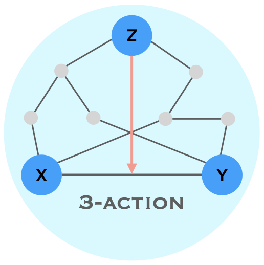

=============================================================================================
Triaction : Python code for triadic interactions
=============================================================================================

This repository contains the Python package called triaction, which enables the detection of triadic interactions. It also provides visualization capabilities to visualise triadic interaction network.

# Add link to arXiv link

-----------------
 Installation
-----------------

.. code-block:: bash    

  $ python setup.py install

-----------------
Data
-----------------

``Continuous data``:
 * Gene expression

-----------------
Usage
-----------------

Display some info about the notebook, and some figures
