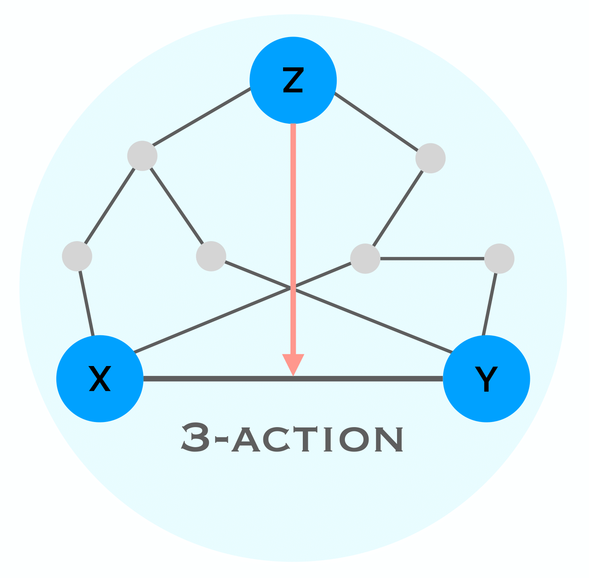

=============================================================================================
triaction : Python code for triadic interactions
=============================================================================================
 
This repository contains the Python package called triaction, which enables the detection of triadic interactions. It also provides visualization capabilities to visualise triadic interaction network.

-----------------
 Installation
-----------------

.. code-block:: bash    

  $ python setup.py install

-----------------
Data
-----------------

``Continuous data``:
 * Gene expression
 * 

``Discrete data`` :
 * CGDB data (Roche)
 * 

-----------------
Usage
-----------------

Detection of the triadic interactions
-----------------

Visualisation of the triadic interactions network
-----------------
