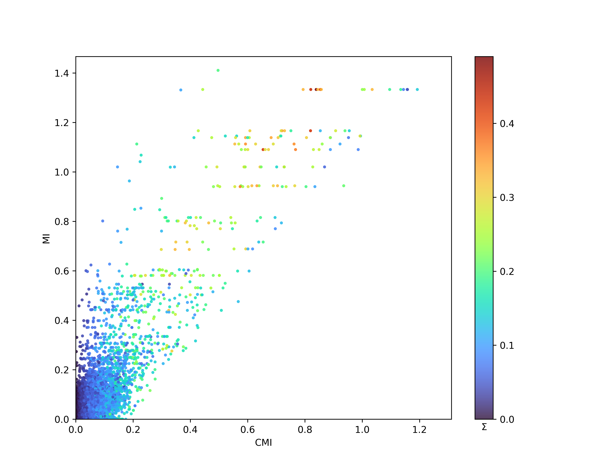
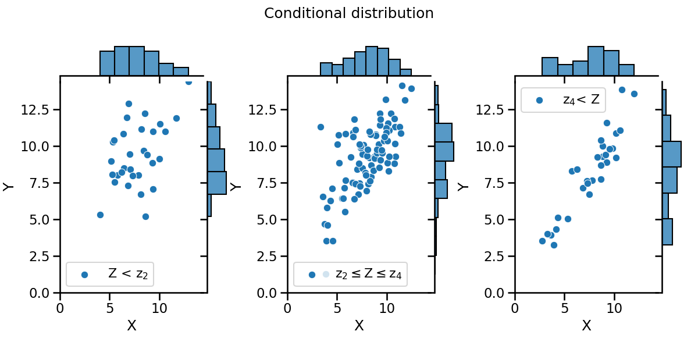
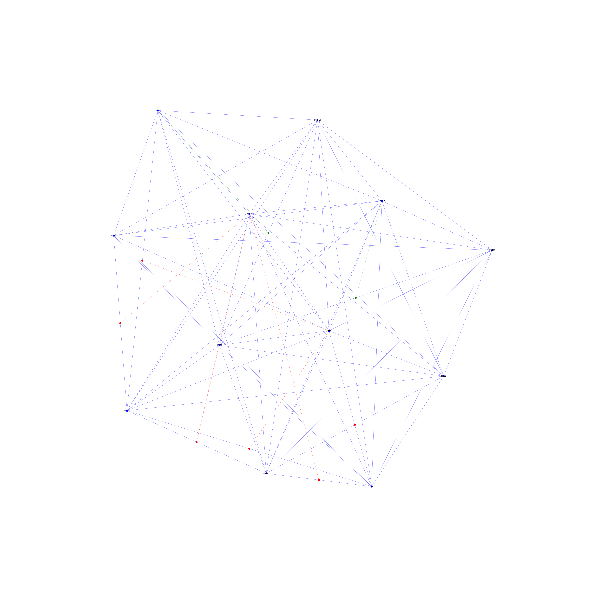

=============================================================================================
Triaction : Python code for triadic interactions
=============================================================================================

.. image:: logo.png
   :width: 200

This repository contains the Python package called triaction, which enables the detection of triadic interactions. It also provides visualization capabilities to visualise triadic interaction network.

The package has been created by Anthony Baptista and Ginestra Bianconi.

# Add link to arXiv link

-----------------
 Installation
-----------------

.. code-block:: bash    

  $ python setup.py install

-----------------
Data
-----------------

``Continuous data``:
 * Gene expression

---------------------------------------------------
Gene expression of Acute Myeloid Leukemia (AML)
---------------------------------------------------

Scatter plot of the results of the Triaction algorithm on AML gene expression data. Each data point shows the information-theoretic measures for a triple of nodes $X$, $Y$ and $Z$, namely MI and CMI, the mutual information and conditional mutual information between $X$ and $Y$, respectively. The colour of each point corresponds to the value of :math:`\Sigma` , which characterises the strength of the triadic interaction between gene $Z$ and the edge between $X$ and $Y$.

.. code-block:: Python  

   from triaction.analysis import decision_tree_val, visualisation_conditioned_val

   gene_expression = pd.read_csv('data/reduce_gene_expression.tsv', sep = '\t', index_col=0)
   name_X = 'GATA1'
   name_Y = 'TAL1'
   name_Z = 'KLF5'
   X = np.array(gene_expression.T[name_X])
   Y = np.array(gene_expression.T[name_Y])
   Z = np.array(gene_expression.T[name_Z])

   timeseries = np.zeros((3,len(X)))
   timeseries[0,:] = X
   timeseries[1,:] = Y
   timeseries[2,:] = Z
   num = 5
   tlen = len(X)
   I = [0,1,2]
   visualisation_conditioned_val(timeseries, I, num, tlen, name = save_folder + '/' + 'good', cond = [th1,th2])

.. code-block:: Python  

   from triaction.triadic_vis import triadic_network_vis_from_data_and_graph

   ppi = pd.read_csv('data/reduce_ppi.tsv', sep = '\t')
   graph_ppi = nx.from_pandas_edgelist(ppi, source = '0', target = '1')
   short_range = pd.read_csv('data/short_range.txt', sep = '\t')

   sub_triadic = pd.concat([short_range[short_range['P']<0.001], long_range[long_range['P']<0.001]]).reset_index()
   sub_sub_triadic = sub_triadic.sort_values(by='Theta', ascending=False).reset_index()
   sub_sub_triadic = sub_sub_triadic[0:10]
   
   set_nodes = set(sub_sub_triadic['reg']).union(set(sub_sub_triadic['node1'])).union(set(sub_sub_triadic['node2']))
   graph_ppi.remove_edges_from(list(nx.selfloop_edges(graph_ppi)))
   sub_graph = nx.Graph(graph_ppi.subgraph(list(set_nodes)))
   
   sub_final = sub_triadic[sub_triadic['node1'].isin(set_nodes)]
   sub_final = sub_final[sub_final['node2'].isin(set_nodes)]
   sub_final = sub_final[sub_final['reg'].isin(set_nodes)]
   sub_final = sub_final.reset_index(drop=True)
   top = len(sub_final)
   triadic_network_vis_from_data_and_graph(sub_graph, sub_final, top)

