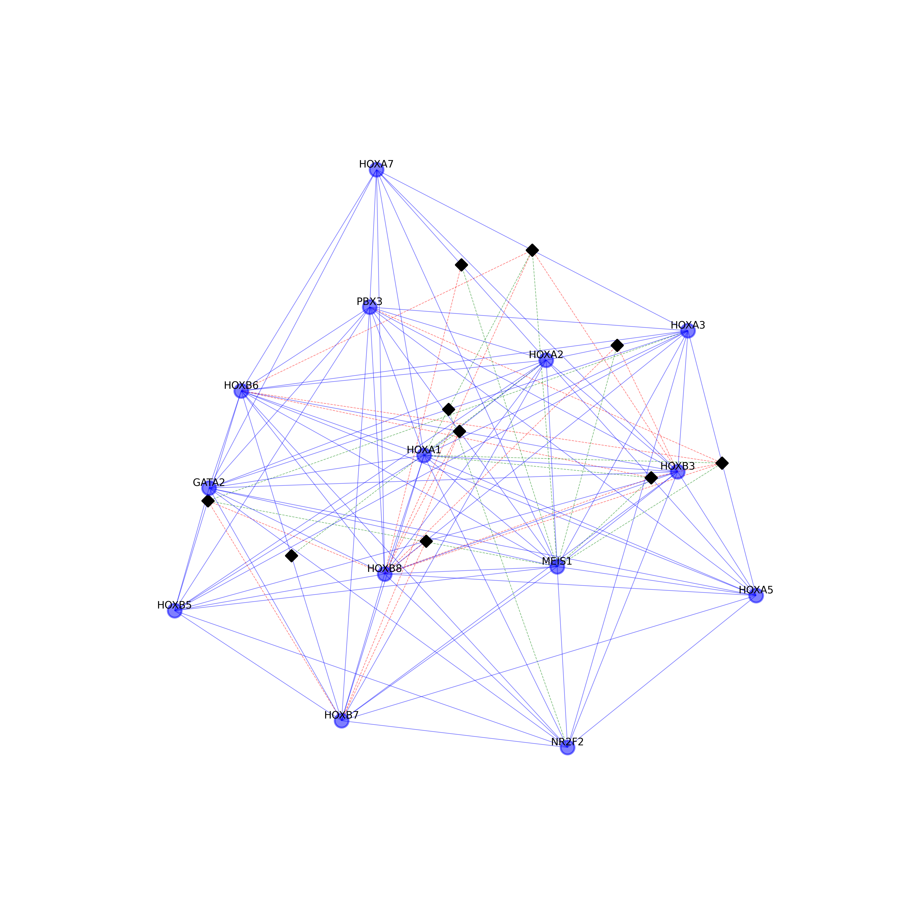

=============================================================================================
Triaction : Python code for triadic interactions
=============================================================================================

.. image:: logo.png
   :width: 200

This repository contains the Python package called triaction, which enables the detection of triadic interactions. It also provides visualization capabilities to visualise triadic interaction network.

The package has been created by Anthony Baptista and Ginestra Bianconi.

# Add link to arXiv link

-----------------
 Installation
-----------------

.. code-block:: bash    

  $ python setup.py install

-----------------
Data
-----------------

``Continuous data``:
 * Gene expression

-----------------
Usage
-----------------

.. image:: output/MI_merge.png
   :width: 200

.. code-block:: Python    
   name_X = 'GATA1'
   name_Y = 'TAL1'
   name_Z = 'KLF5'
   X = np.array(gene_expression.T[name_X])
   Y = np.array(gene_expression.T[name_Y])
   Z = np.array(gene_expression.T[name_Z])
   timeseries = np.zeros((3,len(X)))
   timeseries[0,:] = X
   timeseries[1,:] = Y
   timeseries[2,:] = Z
   I = [1,2,3]
   num = 5
   tlen = len(X)
   nrunmax = 1000
   MI, MIz, MIz_null, MIC, Theta_S, Theta2_T, Theta2_Tn, Sigma, Sigma_null_list, P, P_T, P_Tn = ifc.Theta_score_null_model(timeseries, I, num, tlen, nrunmax, True, True)
   MI, MIz, MIC, Corr_Sigma, Sigma, T, Tn, MINDY, MI1, MI2 = ifc.mutual_information_analysis_continuous_extended(timeseries, [0,1,2], num, tlen)
   x = range(1, num+1)
   th1,th2,c = decision_tree(x, MIz, disp_fig=True, disp_txt_rep=True,
                 disp_tree=True, name=save_folder + '/' + 'good_decision_tree')
   I = [0,1,2]
   visualisation_conditioned_val(timeseries, I, num, tlen, name = save_folder + '/' + 'good', cond = [th1,th2])

